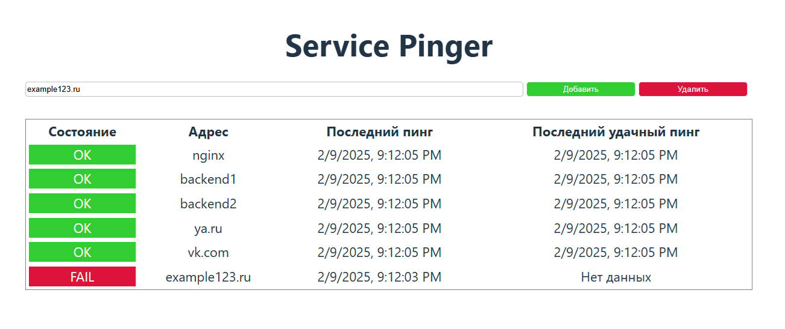

## Service Pinger 
Приложение, разработанное в рамках профильного задания на стажировку в VK Tech

### Задача
Необходимо написать приложение на языках программирования
Go и JavaScript(TS), которое получает ip адреса контейнеров docker, пингует их
с определенным интервалом и помещает данные в базу данных. Получение данных о 
состоянии контейнеров доступно на динамически формируемой веб-странице  
### Описание функционала приложения
1. На веб-странице (по умолчанию порт 8080) отображаются все пингуемые сервисы.
Их можно добавлять/удалять с помощью кнопок интерфейса, введя в поле соответствующий адрес.
2. На веб-сайте выводятся данные о том: отвечает ли сервис на пинг, когда последний раз был 
пинг данного сервиса, а также когда был последний успешный пинг
3. Если данных ещё нет/либо нет данных об успешном пинге того или иного сервиса, то на сайте пишется "Нет данных" 
4. Веб-сайт обновляет данные с бэкенда раз в одну секунду.
5. Pinger пингует все указанные сервисы/docker контейнеры раз в 
настраиваемое количество секунд (настраивается в vars_pinger.env файле, по умолчанию 5 секунд)
При этом посылается настраиваемое количество пакетов (настраивается там же, по умолчанию 3)
6. В проекте есть две конфигурации для docker-compose: первая для разработки бэкенда (файл docker-compose.yml), в ней настроен watch (для backend1, backend2, pinger), 
который перезапустит определенные контейнеры при сборке нового исполняемого файла в папку build, при это используются образы без инструментов для компиляции Golang.
Вторая для сборки проекта полностью внутри docker-контейнеров (docker-compose-inner.yml). Удобна для запуска приложения на той машине где инструментов для компиляции нет (условный прод, где необходимо все запустить за пару команд)
### Запуск 
1. git clone https://github.com/ArtyomFuzis/DockerPinger
2. Скачать/Обновить Docker. Удостоверится в его доступности в $PATH
3. Запустить Docker
4. Перейти в папку проекта: cd .\DockerPinger\
5. Собрать Compose Stack: docker-compose -f docker-compose-inner.yml build
6. Запустить приложение: docker-compose -f docker-compose-inner.yml up
7. Подождать загрузки приложения, перейти на http://localhost:8080. Или при необходимости сменить порт в docker-compose-inner.yml (приложение открывает только один порт)
8. Использовать приложение и не нарваться на баги) 
### Реализованные доп. задания 
1. Настроен nginx в качестве балансировщика нагрузки, что по очереди отправляет запросы пользователей на разные backend (для демонстрации в приложении их запускается два)
2. В качестве сервиса очередей используется RabbitMQ, он используется для пересылки сообщений между backend и pinger (вместо REST Call)
3. Все конфигурации верификаций вынесены в .env файлы (по умолчанию используется примеры .env.example)

**P.S.** Первый раз пишу на Go, код очень даже кривоват